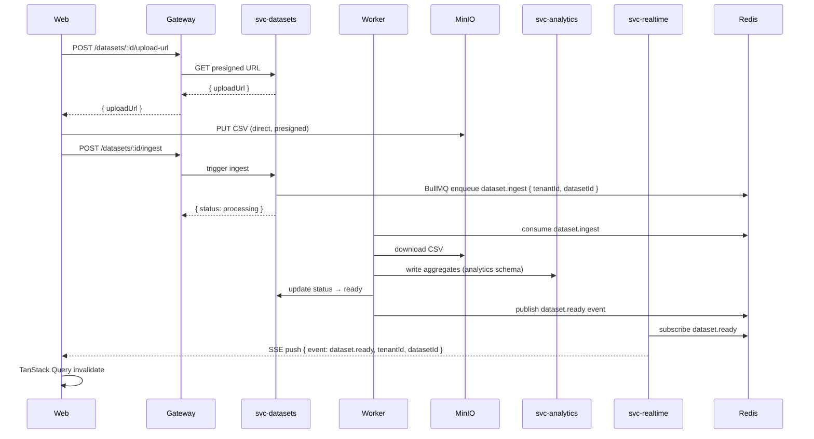

# Smartboard

> Multi-tenant analytics and dashboard platform — monorepo.

---

## Architecture Overview


---

## Dataset Ingestion Flow



---

## Theme Persistence Flow


---

## Service Discovery Strategy

### Local (Docker Compose)

Services communicate via docker compose DNS:

```
http://smartboard-svc-auth:4010
http://smartboard-svc-tenants:4020
http://smartboard-svc-datasets:4030
http://smartboard-svc-analytics:4040
http://smartboard-svc-dashboards:4050
http://smartboard-svc-realtime:4060
```

The Gateway reads these from env vars:

```
AUTH_BASE_URL=http://smartboard-svc-auth:4010
TENANTS_BASE_URL=http://smartboard-svc-tenants:4020
...
```

### AWS ECS (Production)

- Each service registers with **AWS Cloud Map** (service discovery).
- Gateway resolves services via Cloud Map DNS names.
- ECS tasks are in a private VPC subnet; only Gateway and Web have ALB exposure.
- Same env vars — just point to Cloud Map DNS names.

---

## ECS-Ready Health Checks

Every backend service exposes:

| Endpoint | Purpose |
|---|---|
| `GET /health/live` | Process alive check — always 200 if running |
| `GET /health/ready` | Dependency checks (DB, Redis) — 200 if ready |

**ALB rules:**
- `smartboard-web` → ALB target group uses `/health/ready`
- `smartboard-gateway` → ALB target group uses `/health/ready`
- Internal services → ECS container health checks use `/health/ready`

**Graceful shutdown:**
- All NestJS apps call `app.enableShutdownHooks()`.
- Handle SIGTERM — ECS sends SIGTERM before task termination, allowing traffic drain.

---

## Request-ID Propagation

```
Client → [x-request-id header or generate UUID]
         → Gateway middleware creates ctx.requestId
         → Sets response header: x-request-id
         → http-client injects x-request-id into all downstream calls
         → All pino log lines include { requestId }
         → Client reads x-request-id from response for tracing
```

---

## Tenant Guard — Done Right

> **Never trust browser-provided tenant IDs blindly.**

Flow:

1. `AuthGuard` authenticates session/JWT → sets `ctx.userId`
2. `TenantGuard` reads `x-tenant-id` header (from tenant switcher)
3. `TenantGuard` calls `svc-tenants` to validate membership
4. If user is NOT a member → **403 Forbidden**
5. If valid → `ctx.tenantId = validatedTenantId`
6. All downstream calls include `x-tenant-id: <validated>`
7. Each service **also** enforces tenant scoping at DB query level (defense in depth)

Routes that skip TenantGuard: `@TenantOptional()` — applied to `/me`, `/tenants`, auth callbacks, `/health/*`.

---

## Local Run Instructions

### Prerequisites

- Node.js 20+
- pnpm 9+
- Docker + Docker Compose

### Steps

```bash
# 1. Clone
git clone https://github.com/ramioooz/smartboard
cd smartboard

# 2. Install dependencies
pnpm install

# 3. Copy env
cp .env.example .env
# Edit .env as needed (defaults work for local docker compose)

# 4. Start infrastructure
docker compose -f infra/compose.yaml up -d smartboard-postgres smartboard-redis smartboard-minio

# 5. Run DB migrations
pnpm db:migrate

# 6. Dev (all apps via turbo)
pnpm dev

# OR run individual apps:
pnpm --filter @smartboard/web dev
pnpm --filter @smartboard/gateway dev
```

### Access

| Service | URL |
|---|---|
| Web | http://localhost:3000 |
| Gateway API | http://localhost:4000 |
| MinIO Console | http://localhost:9001 |

---

## DB Migrations

Each service owns its Prisma schema + migrations. All target the same Postgres instance using separate schemas.

```bash
# Migrate all services
pnpm db:migrate

# Or per service:
pnpm --filter @smartboard/svc-auth run db:migrate

# Generate Prisma client after schema changes:
pnpm db:generate
```

---

## AWS Migration Checklist

- [ ] ECS Fargate task definitions per service (web, gateway, svc-*)
- [ ] Application Load Balancer + HTTPS listener (ACM certificate)
- [ ] ALB target groups for web (:3000) and gateway (:4000)
- [ ] Internal services accessible only within VPC (no ALB)
- [ ] RDS Aurora PostgreSQL (single cluster, separate schemas)
- [ ] ElastiCache Redis (cluster mode off for MVP, enable later)
- [ ] S3 bucket (replace MinIO) — `smartboard-datasets-<env>`
- [ ] CloudWatch Log Groups per service (`/smartboard/<service>`)
- [ ] AWS Secrets Manager for secrets (DB creds, JWT secret, OIDC secrets)
- [ ] SSM Parameter Store for non-secret config
- [ ] Cloud Map namespace for internal service discovery
- [ ] ECR repositories per service (`smartboard-<service>`)
- [ ] GitHub Actions → ECR push + ECS deploy workflow
- [ ] IAM task roles with least-privilege policies
- [ ] VPC with private subnets + NAT gateway
- [ ] WAF attached to ALB (OWASP top 10 rules)
- [ ] CloudWatch alarms for health check failures

---

## Future Improvements

- **Contract testing** — Pact or similar for service contracts
- **API versioning** — `/v1/` prefix, deprecation headers
- **SLOs and alerts** — latency p99, error rate, availability
- **Canary / blue-green deployments** — CodeDeploy + ECS
- **CSRF / CSP / WAF** — production hardening
- **Secrets rotation** — Secrets Manager rotation lambdas
- **Backups / PITR** — RDS automated backups, MinIO versioning → S3
- **Metrics exporters** — Prometheus + Grafana or CloudWatch EMF
- **Audit logs** — immutable audit trail per tenant
- **Disaster recovery plan** — RTO/RPO targets, cross-region snapshots

---

## Project Structure

```
smartboard/
├── apps/
│   ├── web/              # Next.js App Router (port 3000)
│   ├── gateway/          # NestJS API edge layer (port 4000)
│   ├── svc-auth/         # Auth service (port 4010)
│   ├── svc-tenants/      # Tenants/workspaces (port 4020)
│   ├── svc-datasets/     # Dataset metadata + presigned URLs (port 4030)
│   ├── svc-analytics/    # Timeseries + aggregates (port 4040)
│   ├── svc-dashboards/   # Dashboard + panel persistence (port 4050)
│   ├── svc-realtime/     # SSE/WS realtime push (port 4060)
│   └── worker/           # BullMQ job processor (port 4070)
├── packages/
│   ├── shared/           # DTOs, Zod schemas, event contracts, types
│   ├── config/           # Shared ESLint, Prettier, tsconfig
│   └── ui/               # Shared UI primitives
├── infra/
│   ├── compose.yaml      # Docker Compose
│   ├── terraform/        # AWS infrastructure scaffold
│   └── scripts/          # DB init, migration helpers
├── .github/workflows/
│   └── ci.yml
├── turbo.json
├── pnpm-workspace.yaml
├── tsconfig.base.json
└── .env.example
```
